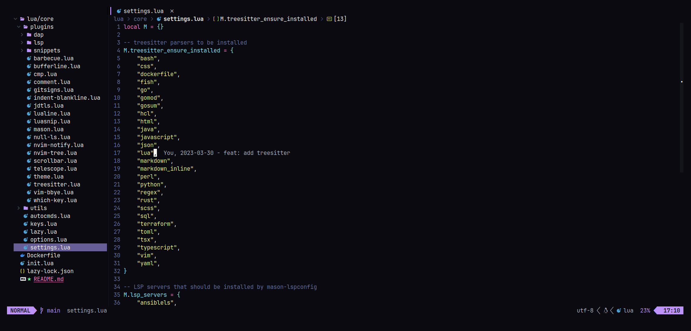

<h1 align="center">My Neovim</h1>

<div align="center">
    <a href="https://github.com/neovim/neovim">
        
    </a>
    <a href="https://github.com/davidborzek/nvim/actions/workflows/docker.yml">
        
    </a>
</div>



## Features

### General

- Plugin configuration via [lazy.nvim](https://github.com/folke/lazy.nvim) with lazy-loading and fast startup times
- Display keybindings with [which-key.nvim](https://github.com/folke/which-key.nvim)
- Nicer notifications using [nvim-notify](https://github.com/rcarriga/nvim-notify)
- File tree navigation via [nvim-tree](https://github.com/nvim-tree/nvim-tree.lua)
- Buffer overview using [bufferline.nvim](https://github.com/akinsho/bufferline.nvim)
- [telescope.nvim](https://github.com/nvim-telescope/telescope.nvim) for modern looking selections and searching
- Better statusline with [lualine.nvim](https://github.com/nvim-lualine/lualine.nvim)

### Coding

- Code completion using [nvim-cmp](https://github.com/hrsh7th/nvim-cmp)
- Managing LSPs, Linters / Formatters and DAP dependencies using [mason](https://github.com/williamboman/mason.nvim) and [mason-lspconfig](https://github.com/williamboman/mason-lspconfig.nvim)
- LSP configuration via [nvim-lspconfig](https://github.com/neovim/nvim-lspconfig)
- [nvim-treesitter](https://github.com/nvim-treesitter/nvim-treesitter) for better syntax highlighting
- Linting integration and toggleable auto-formatting with [null-ls.nvim](https://github.com/jose-elias-alvarez/null-ls.nvim)
- VS code like winbar via [barbecue.nvim](https://github.com/utilyre/barbecue.nvim)
- Git integration via [gitsigns.nvim](https://github.com/lewis6991/gitsigns.nvim)
- Indent guides powered by [indent-blankline.nvim](https://github.com/lukas-reineke/indent-blankline.nvim])
- Snippets with auto completion via [LuaSnip](https://github.com/L3MON4D3/LuaSnip)
- Configured Language Servers for Bash, (S)CSS, Golang, TypeScript, YAML, Lua, JSON, Rust, Ansible and Java.

## Try it out

You can easily try this setup using [Docker](https://www.docker.com/) using the provided `Dockerfile`.

### Build the image

```bash
docker build -t nvim .
```

### Start nvim

```bash
docker run --rm -it nvim
```

> Info: You can also mount a local directory into the container using the `-v` flag.

